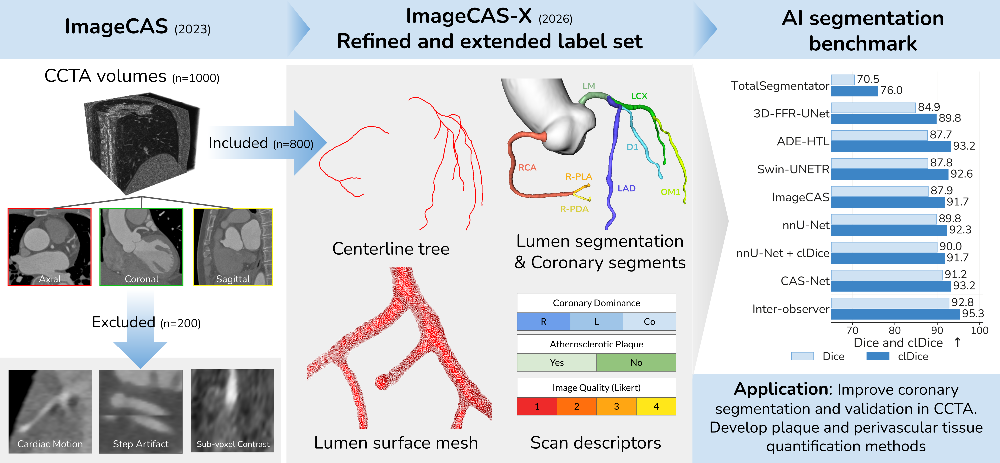
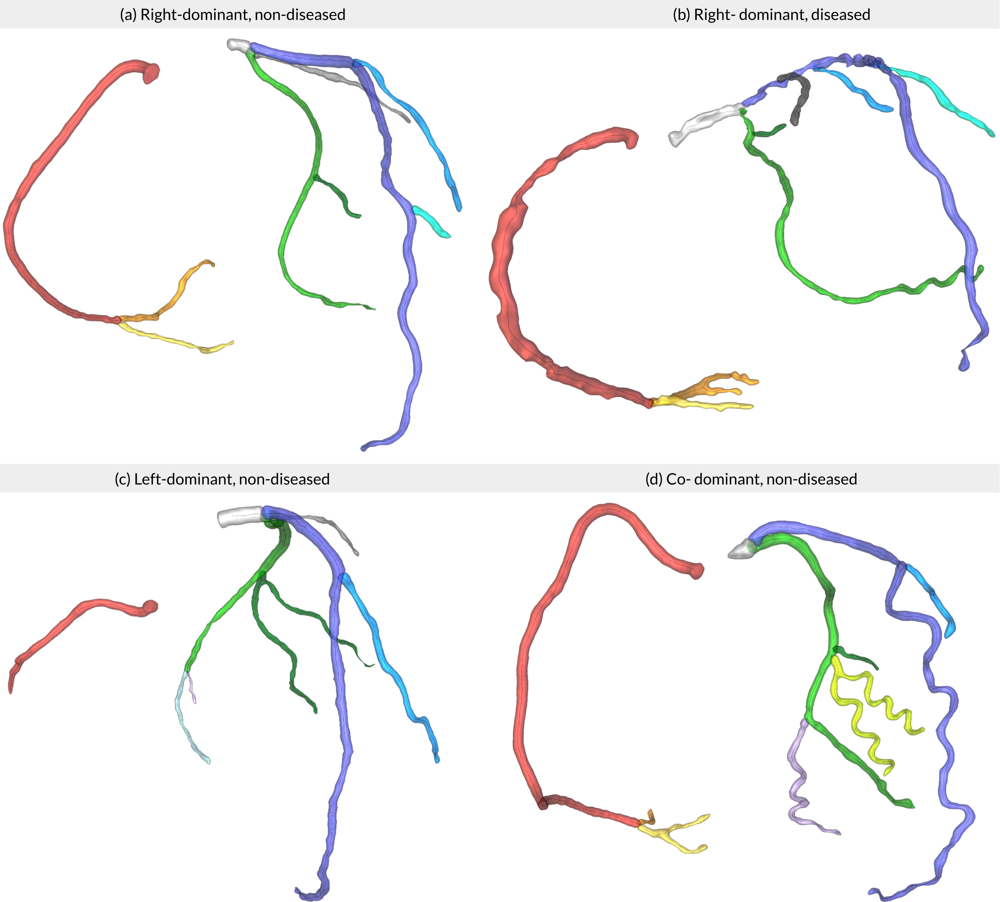

<h1 align="center">ImageCAS-X: A dataset and benchmark for validating coronary vessel segmentation and centerline extraction in computed tomography angiography</h1>


<p align="center">
  <a href="https://arxiv.org"></a>
  <a href="https://kitbransby.github.io/ImageCAS-X/"></a>
</p>

<p align="center">
  
</p>

## Table of Contents

- [Highlights](#highlights)
- [Dataset](#dataset)
- [Installation](#installation)
- [Quickstart](#quickstart)
  - [Data preparation](#data-preparation)
  - [Train](#train)
  - [Inference](#inference)
  - [Evaluate](#evaluate)
- [Included Methods](#included-methods)
- [Configs](#configs)
- [Extending the Benchmark](#extending-the-benchmark)
- [Metrics](#metrics)
- [Multi-Step Methods](#multi-step-methods)
- [Citation](#citation)


## Highlights

* New label set of the coronary vessel lumen and coronary segments, alongside centerlines and mesh surfaces, for 800 CCTA scans of the publicly available ImageCAS cohort.
* Pretrained weights included for 5 coronary-specific segmentation methods and 3 general-purpose segmentation methods, benchmarked against the agreement between expert analysts. 
* Performance stratified by disease, image quality, coronary dominance, coronary segment, vessel diameter, and lumen attenuation.
* The labels support development and validation of methods for lumen segmentation, plaque and perivascular quantification, and haemodynamic modelling.

## Dataset

The dataset is described in our publication: "ImageCAS-X: a dataset and benchmark for coronary artery segmentation and centerline extraction in coronary CT angiography" <a href="https://arxiv.org"></a>. Available to download here:   <a href="https://kitbransby.github.io/ImageCAS-X/"></a>

The following labels are computed:

* **0 : Background**
* **1 : LM** : Left main
* **2 : LAD** : Left anterior descending artery
* **3 : LCx** : Left circumflex artery 
* **4 : D1** : First diagonal branch
* **5 : D2** : Second diagonal branch
* **6 : OM1** : First obtuse marginal branch
* **7 : OM2** : Second obtuse marginal branch
* **8 : IM** : Intermediate branch (ramus intermedius)
* **9 : RCA** : Right coronary artery
* **10 : R-PDA** : Right posterior descending artery
* **11 : R-PLA** : Right posterior lateral artery
* **12 : L-PDA** : Left posterior descending artery
* **13 : L-PLA** : Left posterior lateral artery
* **14 : Other** : Includes D3, D4, OM3, OM4 branches 

<p align="center">
  
</p>
<p align="center">
  <em>Sample coronary segments and centerlines for right-, left- and co-dominant trees and diseased versus non-diseased patients.</em>
</p>


## Installation

**1. Create a fresh environment with Python ≥ 3.10 and PyTorch ≥ 2.0.** Install
torch first and pick the CUDA build that matches your system: https://pytorch.org/get-started/locally/


**2. Clone the repo and install it.** 

```bash
git clone https://github.com/kitbransby/ImageCAS-X.git
cd ImageCAS-X
pip install -e .
```

**3. Export your data and results paths.** Every config reads these, so
this is the only place you need to set them:

```bash
export ImageCAS_X_data_path=/path/to/data/dir
export ImageCAS_X_results_path=/path/to/results/dir
```

`ImageCAS_X_data_path` is the dataset root (see
[Data preparation](#data-preparation) for the expected layout);
`ImageCAS_X_results_path` is where training/inference/evaluation runs get
written. 

> The nnU-Net package needs to be installed separately, outside of this repo.


## Quickstart

### Data preparation

Download the ImageCAS-X CCTA volumes [](https://www.kaggle.com/datasets/xiaoweixumedicalai/imagecas) and our ground truth labels [](https://kitbransby.github.io/ImageCAS-X/).

You can also use your own data by following this structure:

```
<data_root>/
├── volumes/            <scan_id>.img.nii.gz
├── segmentations/      <scan_id>.coronary.nii.gz
├── centerlines/        <scan_id>.coronary_{left,right}_centerline.vtk
├── surfaces/           <scan_id>.coronary_mesh.vtk
└── filelist/           train.txt / val.txt / test.txt / exclude.txt
```

- **Directory names and suffixes** are all config fields (`data.volume_dir`,
  `data.gt_mask_dir`, `data.filelist_dir`, `data.volume_suffix`,
  `data.mask_suffix`, `data.file_extension`). Change them in
  `configs/pipeline.json` if your layout differs.
- **Splits** are read from `filelist_dir`'s `train/val/test.txt` and take
  precedence over any inline `train_ids`/`val_ids`/`test_ids`; IDs listed in
  `exclude.txt` are dropped from every split.
- **Masks are multi-label** (`0` = background, `1–14` = coronary branch lumen).
  The dataloader binarises them to lumen vs background. Disable via
  `data.params.binarise_lumen = false`, or add your own transformation.

**Resample offline before training.** Every method expects a volume resampled to 0.5 mm
isotropic spacing. Doing it once up front rather than on every
`__getitem__` makes training substantially faster, and the cache is shared
across all methods:

```bash
python -m utils.offline_resample_images_to_disk -c configs/<method_name>.json --workers 8
```

This writes `.npy` caches to `<data_root>/volumes_resampled/` and
`<data_root>/segmentations_resampled/` (masks stay multi-label). The
config's `data.volume_dir` / `data.gt_mask_dir` should point at those directories.

### Train

```bash
python -m train -c configs/<method_name>.json
```

- Each run gets its own timestamped folder under `results_root`, e.g.
  `<results_root>/<run_dir>/`, printed at startup as
  `[train] run_dir=...`. The best-validation checkpoint and loss curves are saved there as
  `<method_name>_best.pt`.

### Inference

> **Requires trained weights.** Pretrained weights are available here [](https://kitbransby.github.io/ImageCAS-X/), or train them yourself with the command above.

`-r` is **required** — pass the run folder name printed by `train.py`.

`--save-probs` is optional and will save the sigmoid/softmax probabilities alongside binarised segmentations. Not required for evaluation.


```bash
python -m inference -c configs/<method_name>.json -r <run_dir>
```

- Runs the model over the test set and applies the postprocessing pipeline.
  Patch-trained methods are inferred on whole volumes: the volume is tiled into
  patches (overlap=50%), each patch is run through the model, and overlapping predictions are
  stitched back together.
- Resamples each prediction back to the scan's original geometry and writes it to
  `<run_dir>/predictions/<scan_id><file_extension>`. 
- This is the only script that loads a model or checkpoint. Methods whose
  predictions come from outside this framework (e.g. nnU-Net) can skip
  it and place predictions under `predictions/` using
  the same naming convention, then run `evaluate.py` directly.

### Evaluate

> **Requires trained weights**: `evaluate.py` scores the
> predictions written by `inference.py`, so run that first (or add
> predictions to `predictions/`).

```bash
python -m evaluate -c configs/<method_name>.json -r <run_dir>
```

- Requires `<run_dir>/predictions/<scan_id><file_extension>` to exist for every
  test scan. `evaluate.py` never loads a model or runs inference itself, and
  always requires GT to compute metrics.
- Computes the configured metrics per scan against the GT, where both are in the original volume space, so distance/volume metrics are in true physical units.
- Also breaks the summary down by scan-level subgroup, reading `<data_root>/Descriptors.xlsx`
  (columns `Scan ID`, `Image Quality`, `Dominance`, `Disease`) — configured by
  `evaluation.descriptors_file` / `descriptors_id_column` / `stratify_by` in
  `configs/pipeline.json`. 
- Writes a summary to `<run_dir>/<method_name>_results.json`: `per_scan`, `summary`,
  and `summary_by_group[<column>][<value>]` (each with the same shape as `summary`).

## Included Methods

Method ranking and full benchmark results are available on the project website:
[](https://kitbransby.github.io/ImageCAS-X/)

| Method | Config | Paper | Additional data |
|---|---|---|---|
| **CAS-Net** | `cas_net.json` | Dong et al., MedIA 2023 [](https://www.sciencedirect.com/science/article/abs/pii/S1361841523000063) | — |
| **FFR-UNet** | `ffr_unet.json` | Song et al., 2022 [](https://ieeexplore.ieee.org/abstract/document/9761739) | — |
| **Swin UNETR** | `swin_unetr.json` | Hatamizadeh et al., MICCAI 2022 [](https://link.springer.com/chapter/10.1007/978-3-031-08999-2_22) | — |
| **ImageCAS** | `imagecas_stage1_coarse.json`<br>`imagecas_stage2_coarse_dilated.json`<br>`imagecas_stage3_patch_{16,32,64}.json`<br>`imagecas_inference.json` | Zeng et al., CMIG 2023 [](https://www.sciencedirect.com/science/article/abs/pii/S0895611123001052) | Per-scan patch-centre `.npy` files for Stage 3 (train and inference) |
| **ADE-HTL** | `ade_htl_stage1_coarse.json`<br>`ade_htl.json` | Zhang et al., IEEE TMI 2024 [](https://ieeexplore.ieee.org/abstract/document/10265156) | TotalSegmentator `heartchambers_highres` masks (inference), precomputed ADE and topology assets (train) |
| **nnU-Net** | External | Isensee et al., Nature Methods 2021 [](https://www.nature.com/articles/s41592-020-01008-z) | — |
| **nnU-Net with clDice** | External | Shit et al., CVPR 2021 [](https://ieeexplore.ieee.org/abstract/document/9578225) | — |
| **TotalSegmentator** | External | Wasserthal et al., Radiology AI 2023 [](https://pubs.rsna.org/doi/full/10.1148/ryai.230024) | — |

## Configs

- Each method is one JSON file in `configs/`, which is merged with the general config `configs/pipeline.json`.
- `pipeline.json` is the standardised pipeline. It fixes everything that must
  be identical across methods for a fair comparison: data location/splits, HU
  window, resample spacing, augmentation, optimizer/LR/scheduler, per-epoch
  iteration budget, default postprocessing, and evaluation metrics.
- A method config declares only what's method-specific: `method_name`,
  `input_type`, `model`, `loss`, `batch_size`/`epochs`, and any deliberate
  override.

## Extending the Benchmark

**Add your own model** — subclass `BaseLumenModel`, return `{"logits": …}`, and register it:

```python
# models/my_method.py
from models.base_model import BaseLumenModel
from models.registry import register_model

@register_model("my_method")
class MyMethod(BaseLumenModel):
    def forward(self, x):            # x: (B, 1, X, Y, Z)
        return {"logits": self.net(x)}
```
…then import it in `models/registry.py` and set
`model.name = "my_method"` in your config.

**Add a loss / preprocessing / postprocessing / augmentation step** — implement the
class and add it to the corresponding `_*_REGISTRY` (in `losses/factory.py`,
`preprocessing/pipeline.py`, `postprocessing/pipeline.py`, or
`augmentation/pipeline.py`).

**Predict on your data** — `python -m inference -c <config> -r <run_dir>` runs a
trained checkpoint over the configured test set and writes predictions to
`<run_dir>/predictions/`, with no ground-truth mask required (`evaluate.py`, which
does require GT to score, is a separate step). Update
`data.test_ids`/`filelist_dir` to point to your dataset.

## Metrics

All metrics are evaluated against the original-resolution ground truth, so
distance and volume values are in true physical units. 

| Metric | Key | Notes |
|---|---|---|
| Dice similarity coefficient | `dice` | — |
| 95% Hausdorff distance (mm) | `hd95` | symmetric: max(HD95(g→p), HD95(p→g)) |
| Betti-0 error | `betti_error_1` | \|connected components(pred) − connected components(gt)\| |
| Betti-1 error | `betti_error_2` | \|loops/tunnels(pred) − loops/tunnels(gt)\| |
| Predicted lumen volume (ml) | `volume_pred_ml` | voxel count × voxel volume / 1000 |
| GT lumen volume (ml) | `volume_gt_ml` | voxel count × voxel volume / 1000 |
| Volume absolute difference (ml) | `volume_mad_ml` | \|vol\_pred − vol\_gt\| |
| Volume bias (ml) | `volume_bias_ml` | vol\_pred − vol\_gt (positive = overestimate) |
| Centerline Dice | `cl_dice` | tubular-structure connectivity (Shit et al. 2021) |
| Centerline mean distance (mm) | `centerline_md` | symmetric (ASSD): mean(MD(g→p), MD(p→g)); pred skeleton vs GT centerline points |
| Centerline HD95 (mm) | `centerline_hd95` | symmetric: max(HD95(g→p), HD95(p→g)); pred skeleton vs GT centerline points |


Beyond the dataset-wide mean, `evaluate.py` breaks results down two ways.

**Scan-level subgroups** come from `<data_root>/Descriptors.xlsx` (columns `Scan ID`,
`Image Quality`, `Dominance`, `Disease`; a `.csv` works too). Every column listed in
`evaluation.stratify_by` is split by its distinct values and the whole metric set is
re-summarised within each. Written to `summary_by_group[<column>][<value>]`.

**Voxel-level / geometric subgroups** — performance by coronary segment, lumen
attenuation and geodesic distance from the ostium. Uses a *local Dice*: Dice inside an
`evaluation.point_metrics.roi_size_mm` cube (default 8 mm) centred on each of a set of
GT centerline sample points. Run the precompute once, then every method's evaluation
picks it up automatically:

```bash
python -m utils.precompute_centerline_samples -c configs/<method>.json --split test
```

Recorded per sample: `dist_mm` (arc length along the vessel from the ostium),
`segment_name` ('LAD'/'LCX'/'RCA'/…), `diameter_mm` (local lumen diameter from the GT
mask), `hu` (mean attenuation over lumen voxels within the local radius). Evaluation then adds `local_dice` per point and reports it grouped by `segment_name` and
by binned `dist_mm` / `hu` / `diameter_mm`. 

Outputs: `summary_by_point_group[<covariate>][<bin>]` in the results JSON, plus
`<run_dir>/point_metrics.csv`. 

## Multi-Step Methods

CAS-Net, FFR-UNet and Swin UNETR are single `train` → `inference` → `evaluate` runs, while ImageCAS and ADE-HTL have multiple steps.

**ImageCAS** — 4 models used in an ensemble

```bash
python -m models.imagecas_baseline.stage2_resample_dilate -c configs/imagecas_stage2_coarse_dilated.json
python -m train -c configs/imagecas_stage1_coarse.json
python -m train -c configs/imagecas_stage2_coarse_dilated.json
python -m models.imagecas_baseline.stage3_generate_centers \
    -c configs/imagecas_stage2_coarse_dilated.json \
    --coarse-checkpoint <stage2_best.pt> --out-dir <centers_dir> --split all
# set data.params.centers_dir in each stage-3 config, then:
python -m train -c configs/imagecas_stage3_patch_{16,32,64}.json   # one run each
# set all 5 model.*_checkpoint fields in imagecas_inference.json, then:
python -m inference -c configs/imagecas_inference.json -r <run_dir>
```

**ADE-HTL** — a coarse step that locates the vessels, then the main network:

```bash
python -m models.ade_htl.precompute_dilated_masks -c configs/ade_htl_stage1_coarse.json --split all
python -m train -c configs/ade_htl_stage1_coarse.json
python -m inference -c configs/ade_htl_stage1_coarse.json -r <run_dir> --split train   # then val, then test
python -m models.ade_htl.precompute_ade     -c configs/ade_htl.json --coarse-run <run_dir> --split all
python -m models.ade_htl.precompute_targets -c configs/ade_htl.json --split all
python -m train -c configs/ade_htl.json
```

**nnU-Net** — use their package, but you can build a nnU-Net dataset from our data structure using this code:

```bash
python -m models.nnunet.data_prep -c configs/<method_name>.json --nnunet-data-folder <dir>
```

## Citation

```bibtex
@article{bransby2026imagecasx,
  title   = {ImageCAS-X: A dataset and benchmark for validating coronary vessel
             segmentation and centerline extraction in computed tomography angiography},
  author  = {Bransby, Kit M. and {\O}ksnebjerg, Esther and Kj{\ae}r, Kristoffer and
             Kirkeby, Jacob and El Youssef, Yasmin and Jim{\'e}nez, A{\"i}da and
             Pedersson, Philip R. and de Knegt, Martina and Kofoed, Klaus F. and
             Paulsen, Rasmus R.},
  journal = {arXiv preprint},
  year    = {2026}
}
```

Please also cite the source works for any method you use.

